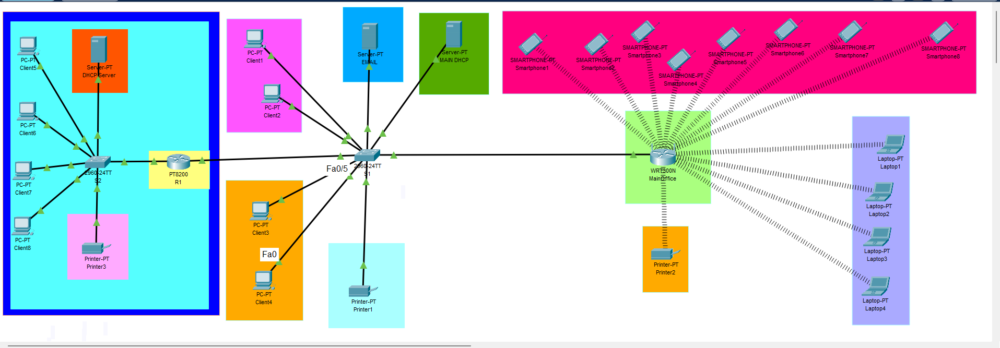

# Secure Business Network Deployment

## Project Overview

This project involved designing and configuring a secure business network using Cisco Packet Tracer.

The scenario was based on a business expanding its network infrastructure and required the configuration of network services, wireless connectivity and basic security controls.

## Project Objectives

The main objectives were to:

- Configure the network topology
- Configure router interfaces
- Configure DHCP
- Configure DNS
- Configure email services
- Configure wireless networking
- Implement WPA2 security
- Configure secure remote access using SSH
- Apply basic network security hardening
- Test network connectivity

## Network Topology

The network was designed and configured using Cisco Packet Tracer.

## Technologies Used

- Cisco Packet Tracer
- Cisco IOS
- IPv4
- DHCP
- DNS
- Email services
- SSH
- Wireless networking
- WPA2-PSK

## Network Configuration

The network included two main network segments:

- Office 1: 192.168.1.0/24
- Office 2: 192.168.2.0/24

The router interfaces were configured to provide connectivity between the networks.

## DHCP Configuration

A DHCP server was configured for Office 2.

The DHCP configuration included:

- Server IP: 192.168.2.1
- Subnet Mask: 255.255.255.0
- Default Gateway: 192.168.1.10
- DNS Server: 192.168.1.10
- Starting Address: 192.168.2.50
- Maximum Users: 100

The client devices were tested to confirm that they could obtain IP addresses automatically.

## Wireless Security

The wireless network was configured with:

- SSID: MainOffice
- Security: WPA2-PSK

Wireless clients successfully connected to the network and received IP addresses.

## Email Configuration

An email server was configured to provide email services within the network.

The email server was configured with:

- Server IP: 192.168.1.2
- Subnet Mask: 255.255.255.0
- Domain: ts.com

## Secure Remote Access

SSH was configured to provide secure remote access to the network device.

This allowed administration of the router through an encrypted remote connection instead of using insecure remote access methods.

## Network Security Hardening

Basic security controls were applied to improve the security of the network infrastructure.

These included:

- Secure remote access using SSH
- Password protection
- Local user authentication
- Basic router security configuration
- WPA2 wireless security

## Testing and Troubleshooting

Network connectivity was tested using tools and commands available in Cisco Packet Tracer.

Testing included:

- Ping tests
- IP address verification
- DHCP verification
- Wireless connectivity testing
- SSH connection testing
- Network troubleshooting

Problems encountered during configuration were investigated and corrected to ensure successful connectivity.

## Project Results

The network was successfully configured and tested in Cisco Packet Tracer.

- DHCP clients successfully received IP addresses
- Wireless devices connected successfully
- SSH was configured for secure remote access
- Network connectivity was tested successfully

## Skills Demonstrated

This project helped me develop practical skills in:

- Network configuration
- IPv4 addressing
- DHCP configuration
- DNS configuration
- Wireless networking
- WPA2 security

- ## Configuration and Testing

The network was configured and tested using Cisco Packet Tracer.

### DHCP

DHCP was configured for Office 2 to automatically assign IP addresses to client devices.

The DHCP configuration included:

- Server IP: 192.168.2.1
- Subnet Mask: 255.255.255.0
- Default Gateway: 192.168.1.10
- DNS Server: 192.168.1.10
- Starting Address: 192.168.2.50
- Maximum Users: 100

Client devices were tested to confirm that they could obtain IP addresses automatically.

### Wireless Security

The wireless network was configured using:

- SSID: MainOffice
- Security: WPA2-PSK
- Wireless clients successfully connected and received IP addresses.

### Secure Remote Access

SSH was configured on the network device to provide secure remote access.

SSH was tested successfully from a client device.

### Network Testing

Network connectivity was tested using ping and other network troubleshooting commands.

The configured devices were able to communicate successfully across the network.

## Security Controls

The project included basic network security controls including:

- SSH for secure remote management
- WPA2-PSK for wireless security
- Password protection for network devices
- Basic network hardening
- Testing and verification of network connectivity

## What I Learned

This project helped me develop practical skills in network configuration, troubleshooting and basic cybersecurity.

I gained hands-on experience with Cisco Packet Tracer, DHCP, DNS, wireless networking, SSH and network security.

It also improved my understanding of how different network devices communicate and how security controls can be applied to protect a business network.
